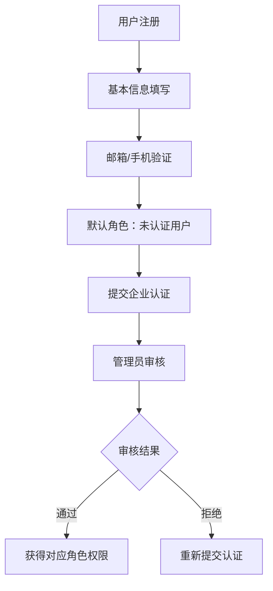
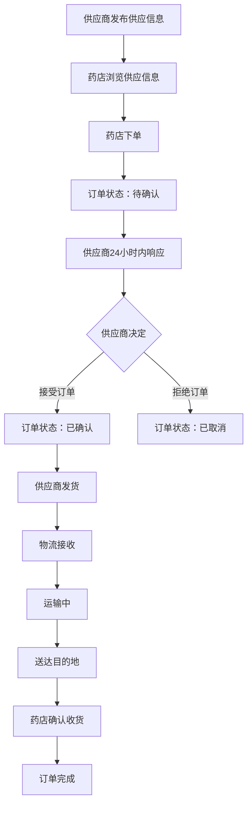

# 项目介绍

## 📋 项目基本信息

**项目名称：** 上海药品信息管理与查询平台（Shanghai Drug Management Platform）
**项目简称：** SH-Drug-Mgmt
**项目类型：** B/S架构Web平台
**开发语言：** 中文（简体）
**项目状态：** 开发中

## 🎯 项目背景与目标

### 项目背景
随着医药行业的快速发展和监管要求的不断提高，传统的药品管理模式面临着信息不对称、流通环节不透明、监管效率低下等挑战。特别是在上海这样的国际化大都市，药品流通的规模和复杂性都对管理提出了更高要求。

### 项目目标
构建一个连接**药店、供应商、监管部门、物流公司**四方的数字化平台，实现：

1. **药品信息集中管理** - 建立统一的药品信息数据库
2. **流通全链路追溯** - 实现药品从出厂到药店的完整追踪
3. **库存智能监控** - 提供实时库存管理和预警机制
4. **B2B模拟交易** - 支持药店与供应商之间的在线采购
5. **监管可视化** - 为监管部门提供数据分析和决策支持

## 🏗️ 系统架构概览

### 技术架构
```
┌─────────────────────────────────────────────────────────────┐
│                        前端展示层                              │
│  Vue3 + Vite + TypeScript + 高德地图API                     │
└─────────────────────────────────────────────────────────────┘
                                │
                                ▼
┌─────────────────────────────────────────────────────────────┐
│                        应用服务层                              │
│           Flask + JWT认证 + RBAC权限控制                      │
└─────────────────────────────────────────────────────────────┘
                                │
                                ▼
┌─────────────────────────────────────────────────────────────┐
│                        数据存储层                              │
│              SQLite (开发) / PostgreSQL (生产)                │
└─────────────────────────────────────────────────────────────┘
```

### 部署架构
```
┌─────────────────┐    ┌─────────────────┐    ┌─────────────────┐
│   药店用户       │    │   供应商用户     │    │   监管部门       │
│   (Chrome/Edge) │    │   (Chrome/Edge) │    │   (Chrome/Edge) │
└─────────────────┘    └─────────────────┘    └─────────────────┘
         │                       │                       │
         └───────────────────────┼───────────────────────┘
                                 │
                    ┌─────────────────┐
                    │   Web服务器     │
                    │   (Nginx)       │
                    └─────────────────┘
                                 │
                    ┌─────────────────┐
                    │   应用服务器     │
                    │   (Flask)       │
                    └─────────────────┘
                                 │
                    ┌─────────────────┐
                    │   数据库服务器   │
                    │   (PostgreSQL)  │
                    └─────────────────┘
```

## 🎨 核心设计理念

### 1. 多租户架构
- **数据隔离：** 每个企业的数据严格隔离，确保数据安全
- **权限分层：** 基于RBAC的细粒度权限控制
- **配置灵活：** 支持不同角色的个性化配置

### 2. 微服务设计
虽然初期采用单体架构，但设计上考虑了未来的微服务拆分：
- **用户服务：** 账户管理、认证授权
- **库存服务：** 库存管理、预警通知
- **订单服务：** 交易流程、状态管理
- **物流服务：** 运输跟踪、路径规划
- **监管服务：** 数据分析、报表生成

### 3. 事件驱动架构
- **状态变更通知：** 订单状态变更实时通知相关方
- **库存预警：** 基于阈值的自动预警机制
- **物流跟踪：** 实时位置信息推送

## 📊 业务流程概览

### 用户注册与认证流程


### B2B交易流程


## 🎯 关键成功因素

### 技术层面
1. **系统稳定性：** 核心功能可用性≥95%
2. **响应速度：** 页面加载≤3秒，API响应≤2秒
3. **数据安全：** 租户数据严格隔离，操作完整审计
4. **扩展性：** 支持10+并发用户，5000+流通记录

### 业务层面
1. **用户体验：** 直观易用的界面设计
2. **流程优化：** 简化操作步骤，提高效率
3. **数据准确性：** 确保库存和流通数据的实时准确
4. **监管合规：** 满足药品监管的合规要求

## 🚧 项目约束与边界

### 功能边界（❌ 不包含）
- **真实支付：** 不支持在线支付功能
- **政府系统集成：** 不与国家药监局系统直连
- **B2C业务：** 仅支持B2B交易模式
- **药品批发：** 不支持大规模批发交易

### 业务约束
- **模拟交易：** 所有交易均为模拟性质，不可用于真实商业交易
- **数据用途：** 监管数据仅供分析使用，不作为执法依据
- **地域限制：** 初期仅服务上海地区

### 技术约束
- **浏览器兼容：** Chrome 90+/Firefox 88+/Edge 90+
- **移动端支持：** V1.0仅支持桌面端访问
- **并发限制：** 初期支持10并发用户

## 📈 项目价值与影响

### 对药店的价值
- **采购效率提升：** 在线浏览供应商信息，快速下单
- **库存管理优化：** 实时库存监控，智能预警提醒
- **合规管理：** 符合药品监管要求，降低合规风险

### 对供应商的价值
- **市场拓展：** 接触更多药店客户，扩大销售渠道
- **订单管理：** 集中管理订单，提高处理效率
- **库存优化：** 实时掌握库存状态，优化生产计划

### 对监管部门的价值
- **监管透明化：** 全流程数据可视化，提高监管效率
- **风险预警：** 异常情况自动预警，及时介入处理
- **决策支持：** 基于大数据的分析报告，支持政策制定

### 对物流公司的价值
- **业务整合：** 集中管理药品运输业务
- **路径优化：** 智能路径规划，降低运输成本
- **实时监控：** 全程运输跟踪，提高服务质量

## 🔮 未来发展规划

### 短期目标（6个月内）
- ✅ 完成核心功能开发
- ✅ 系统测试和优化
- ✅ 试点用户上线运行

### 中期目标（1年内）
- 🔄 扩展到更多用户
- 🔄 增加移动端支持
- 🔄 集成更多第三方服务

### 长期目标（2年内）
- 📅 扩展到其他城市
- 📅 支持更多药品类型
- 📅 增加AI智能分析功能

---

**文档版本：** v1.0
**创建时间：** 2024-10-25
**更新时间：** 2024-10-25
**维护人员：** 项目团队