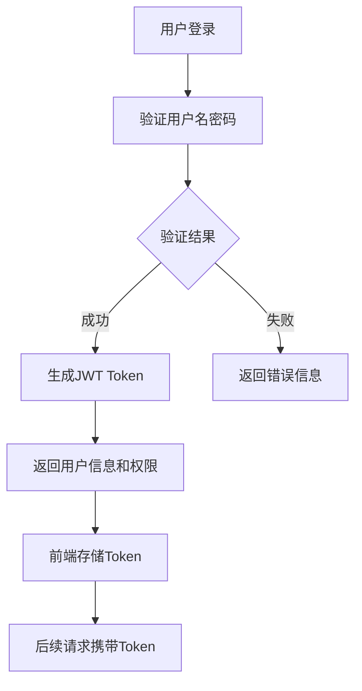
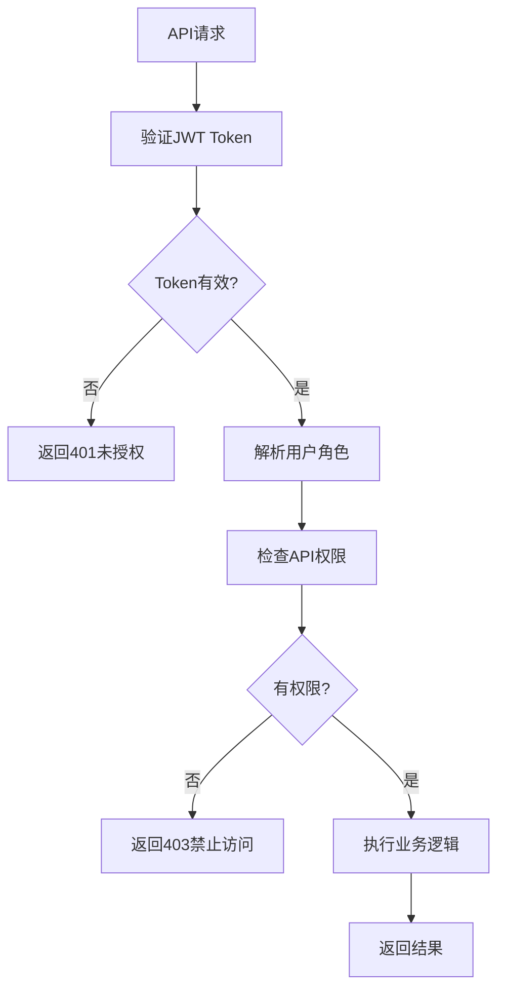
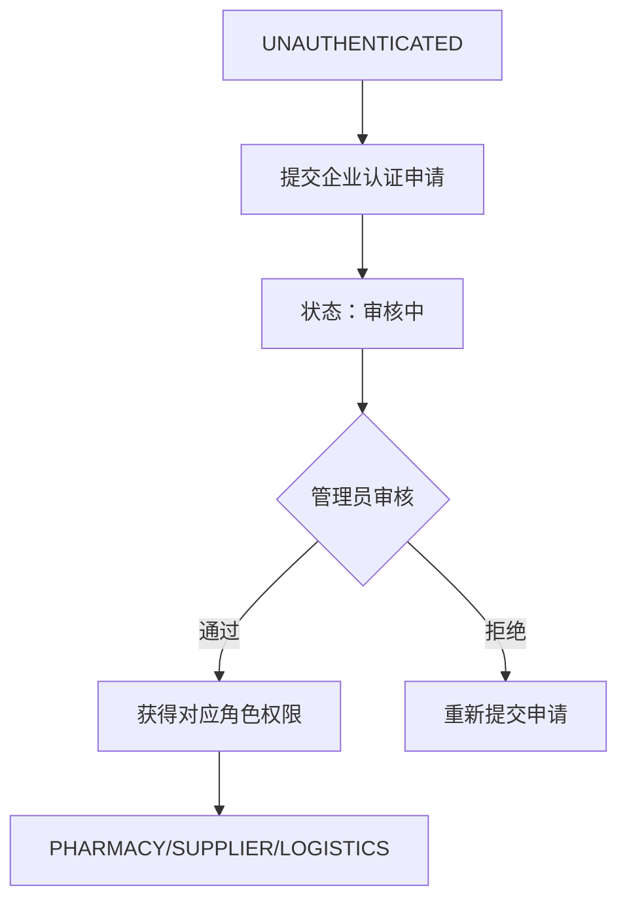
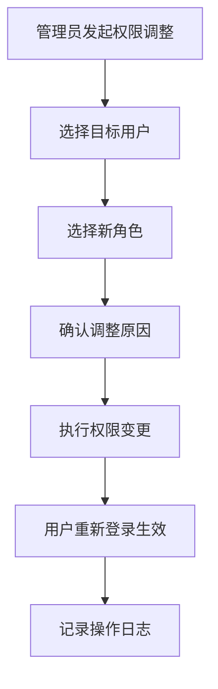

# 用户角色与权限管理

## 👥 用户角色概览

系统采用基于角色的访问控制（RBAC）模型，定义了6种用户角色，每种角色对应不同的业务需求和操作权限。

### 角色层次结构
```
ADMIN (系统管理员)
    ├── REGULATOR (监管用户)
    ├── LOGISTICS (物流用户)
    ├── SUPPLIER (供应商用户)
    ├── PHARMACY (药店用户)
    └── UNAUTHENTICATED (未认证用户)
```

## 🎭 角色详细说明

### 1. 未认证用户 (UNAUTHENTICATED)

**角色描述：** 新注册用户的默认角色，在完成企业认证前的基础权限。

**主要权限：**
- ✅ 查看公开的药品信息
- ✅ 提交企业认证申请
- ✅ 修改个人资料（用户名、密码、联系方式）
- ✅ 查看系统帮助文档

**限制权限：**
- ❌ 无法查看任何企业的商业信息
- ❌ 无法进行库存管理
- ❌ 无法发布或查看供应信息
- ❌ 无法下单采购

**认证要求：** 需要提交企业认证申请以获得更高权限

---

### 2. 药店用户 (PHARMACY)

**角色描述：** 药店企业的操作用户，主要负责药品采购和库存管理。

**主要权限：**
- ✅ 管理本企业药品库存（登记、更新、删除）
- ✅ 查看所有供应商的公开供应信息
- ✅ 向供应商下单采购
- ✅ 管理本企业的订单（查看、取消、确认收货）
- ✅ 查看本企业的库存预警信息
- ✅ 查看订单的物流状态

**企业认证要求：**
- 《药品经营许可证》
- 《营业执照》

**操作范围：** 仅限本企业数据

---

### 3. 供应商用户 (SUPPLIER)

**角色描述：** 药品生产或批发企业的操作用户，负责供应管理和订单处理。

**主要权限：**
- ✅ 管理本企业药品库存
- ✅ 发布、修改、下架供应信息
- ✅ 查看收到的采购订单
- ✅ 确认或拒绝订单
- ✅ 发货操作（生成运单号）
- ✅ 查看本企业的订单统计

**企业认证要求：**
- 《药品生产许可证》或《药品经营许可证》(批发)
- 《营业执照》

**业务规则：**
- 24小时内必须响应PENDING状态的订单
- 有PENDING订单的供应信息不可下架
- 订单确认后药店不可单方面取消

---

### 4. 监管用户 (REGULATOR)

**角色描述：** 政府监管部门的分析用户，负责数据监控和合规分析。

**主要权限：**
- ✅ 查看所有企业的公开数据
- ✅ 查看药品流通全链路信息
- ✅ 生成各类监管分析报告
- ✅ 查看异常情况和预警信息
- ✅ 导出合规分析数据（PDF/Excel）

**企业认证要求：** 无需企业认证，由管理员直接创建

**数据访问范围：**
- 所有企业的库存数据（聚合统计）
- 所有订单的流转信息
- 所有流通记录和物流数据
- 合规分析相关数据

**限制权限：**
- ❌ 无法修改任何业务数据
- ❌ 无法进行企业认证审核
- ❌ 无法管理用户账户

---

### 5. 物流用户 (LOGISTICS)

**角色描述：** 物流公司的操作用户，负责运输状态跟踪和路径规划。

**主要权限：**
- ✅ 上报运输状态和位置信息
- ✅ 管理运单信息
- ✅ 查看分配的运输任务
- ✅ 使用路径规划功能
- ✅ 更新运输进度

**企业认证要求：**
- 《道路运输经营许可证》
- 《营业执照》

**核心职责：**
- 实时更新订单的物流状态
- 确保运输信息的准确性
- 提供预计到达时间

**状态上报权限：**
- SHIPPED（已发货）
- IN_TRANSIT（运输中）
- DELIVERED（已送达）

---

### 6. 系统管理员 (ADMIN)

**角色描述：** 系统的超级管理员，负责用户管理、权限配置和系统维护。

**主要权限：**
- ✅ 用户账户管理（创建、禁用、删除）
- ✅ 企业认证审核
- ✅ 角色权限分配和调整
- ✅ 系统配置管理
- ✅ 查看所有操作日志
- ✅ 系统备份和维护
- ✅ 创建监管用户账户

**特殊权限：**
- 可以查看任何用户的详细信息
- 可以修改任何用户的角色（除自己外）
- 可以重置用户密码
- 可以查看系统运行状态

**责任约束：**
- 所有管理操作必须有明确的业务理由
- 重要操作需要记录详细日志
- 定期审查用户权限的合理性

## 🔐 权限控制机制

### 认证机制


### 授权验证


### 数据隔离
- **租户ID校验：** 所有数据查询必须包含tenant_id条件
- **前后端双重验证：** 前端菜单控制 + 后端API权限校验
- **操作日志记录：** 所有关键操作记录到operation_logs表

## 📋 权限矩阵

| 功能模块 | UNAUTHENTICATED | PHARMACY | SUPPLIER | REGULATOR | LOGISTICS | ADMIN |
|----------|-----------------|----------|----------|-----------|-----------|-------|
| 用户注册 | ✅ | ❌ | ❌ | ❌ | ❌ | ❌ |
| 企业认证申请 | ✅ | ❌ | ❌ | ❌ | ❌ | ❌ |
| 库存管理 | ❌ | ✅(本企业) | ✅(本企业) | ❌ | ❌ | ✅ |
| 供应信息发布 | ❌ | ❌ | ✅(本企业) | ❌ | ❌ | ✅ |
| 供应信息查看 | ❌ | ✅(公开) | ❌ | ❌ | ❌ | ✅ |
| 下单采购 | ❌ | ✅ | ❌ | ❌ | ❌ | ✅ |
| 订单管理 | ❌ | ✅(本企业) | ✅(本企业) | ✅(查看) | ❌ | ✅ |
| 物流状态上报 | ❌ | ❌ | ❌ | ❌ | ✅ | ✅ |
| 流通数据查看 | ❌ | ✅(相关) | ✅(相关) | ✅(全部) | ✅(相关) | ✅ |
| 监管分析报告 | ❌ | ❌ | ❌ | ✅ | ❌ | ✅ |
| 路径规划 | ❌ | ❌ | ❌ | ✅ | ✅ | ✅ |
| 用户管理 | ❌ | ❌ | ❌ | ❌ | ❌ | ✅ |
| 企业认证审核 | ❌ | ❌ | ❌ | ❌ | ❌ | ✅ |
| 系统配置 | ❌ | ❌ | ❌ | ❌ | ❌ | ✅ |

## 🔄 角色转换流程

### 企业认证流程


### 权限调整流程


## 🛡️ 安全措施

### 密码安全
- **最小长度：** 8位字符
- **复杂度要求：** 必须包含字母和数字
- **存储方式：** bcrypt加密存储
- **找回机制：** 通过手机/邮箱验证码重置

### 会话管理
- **Token有效期：** 24小时
- **刷新机制：** 支持Token刷新
- **多点登录：** 支持同一账户多设备登录
- **强制下线：** 管理员可强制用户下线

### 操作审计
- **日志范围：** 所有API调用和数据修改操作
- **日志内容：** 用户、时间、操作内容、IP地址
- **日志保留：** 至少保留6个月
- **异常监控：** 异常操作自动告警

## 📊 权限管理最佳实践

### 管理员操作指南
1. **定期审查：** 每季度审查用户权限分配
2. **最小权限原则：** 只分配必要的权限
3. **权限分离：** 关键操作需要多人审批
4. **及时回收：** 离职用户权限立即回收

### 用户安全建议
1. **强密码：** 使用复杂密码并定期更换
2. **不共享：** 账户密码不与他人共享
3. **及时登出：** 使用完毕后及时退出系统
4. **异常报告：** 发现异常情况立即报告

---

**文档版本：** v1.0
**创建时间：** 2024-10-25
**更新时间：** 2024-10-25
**维护人员：** 项目团队