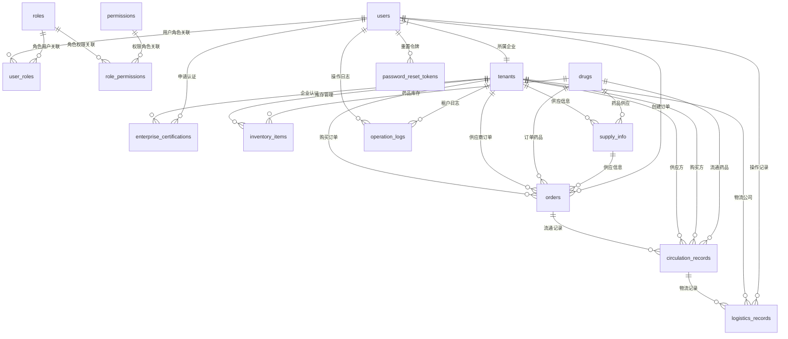

# 数据库设计文档

## 📊 数据库概览

上海药品信息管理与查询平台采用关系型数据库设计，包含15张核心表，支持多租户架构和完整的业务流程。

### 数据库基本信息
- **开发环境：** SQLite 3.x
- **生产环境：** PostgreSQL 14+
- **ORM框架：** SQLAlchemy
- **字符集：** UTF-8
- **时区：** Asia/Shanghai

## 🏗️ 数据库架构设计

### 核心设计原则
1. **多租户隔离：** 所有业务表包含tenant_id字段
2. **数据完整性：** 外键约束确保数据一致性
3. **审计追踪：** 关键操作记录操作日志
4. **性能优化：** 合理的索引设计
5. **扩展性：** 预留扩展字段

### 数据库表分类
```
数据库表结构
├── 用户权限类 (5张)
│   ├── users                # 用户基本信息
│   ├── roles                # 角色定义
│   ├── permissions          # 权限定义
│   ├── user_roles           # 用户角色关联
│   └── role_permissions     # 角色权限关联
├── 企业认证类 (2张)
│   ├── tenants              # 企业信息
│   └── enterprise_certifications  # 企业认证
├── 业务核心类 (6张)
│   ├── drugs                # 药品信息
│   ├── inventory_items      # 库存项
│   ├── supply_info          # 供应信息
│   ├── orders               # 订单
│   ├── circulation_records  # 流通记录
│   └── logistics_records    # 物流记录
├── 系统管理类 (2张)
│   ├── operation_logs       # 操作日志
│   └── password_reset_tokens # 密码重置令牌
```

## 📋 表结构详细设计

### 1. 用户权限类表

#### users - 用户表
```sql
CREATE TABLE users (
    id INTEGER PRIMARY KEY AUTOINCREMENT,
    username VARCHAR(50) UNIQUE NOT NULL,           -- 用户名(唯一)
    password_hash VARCHAR(255) NOT NULL,            -- 密码哈希
    email VARCHAR(100) UNIQUE,                      -- 邮箱
    phone VARCHAR(20) UNIQUE,                       -- 手机号
    real_name VARCHAR(50),                          -- 真实姓名
    tenant_id INTEGER NOT NULL,                     -- 租户ID
    is_active BOOLEAN DEFAULT TRUE,                 -- 账号状态
    last_login_at TIMESTAMP,                        -- 最后登录时间
    created_at TIMESTAMP DEFAULT CURRENT_TIMESTAMP,
    updated_at TIMESTAMP DEFAULT CURRENT_TIMESTAMP,
    FOREIGN KEY (tenant_id) REFERENCES tenants(id)
);

-- 索引
CREATE INDEX idx_users_username ON users(username);
CREATE INDEX idx_users_email ON users(email);
CREATE INDEX idx_users_phone ON users(phone);
CREATE INDEX idx_users_tenant_id ON users(tenant_id);
```

#### roles - 角色表
```sql
CREATE TABLE roles (
    id INTEGER PRIMARY KEY AUTOINCREMENT,
    name VARCHAR(50) UNIQUE NOT NULL,               -- 角色名称
    display_name VARCHAR(100) NOT NULL,             -- 显示名称
    description TEXT,                               -- 角色描述
    is_system BOOLEAN DEFAULT FALSE,                -- 是否系统角色
    created_at TIMESTAMP DEFAULT CURRENT_TIMESTAMP,
    updated_at TIMESTAMP DEFAULT CURRENT_TIMESTAMP
);

-- 预定义角色数据
INSERT INTO roles (name, display_name, description, is_system) VALUES
('UNAUTHENTICATED', '未认证用户', '新注册用户默认角色', TRUE),
('PHARMACY', '药店用户', '药店企业操作用户', TRUE),
('SUPPLIER', '供应商用户', '药品生产或批发企业用户', TRUE),
('REGULATOR', '监管用户', '政府监管部门用户', TRUE),
('LOGISTICS', '物流用户', '物流公司操作用户', TRUE),
('ADMIN', '系统管理员', '系统超级管理员', TRUE);
```

#### permissions - 权限表
```sql
CREATE TABLE permissions (
    id INTEGER PRIMARY KEY AUTOINCREMENT,
    name VARCHAR(100) UNIQUE NOT NULL,              -- 权限名称
    resource VARCHAR(50) NOT NULL,                  -- 资源类型
    action VARCHAR(50) NOT NULL,                    -- 操作类型
    description TEXT,                               -- 权限描述
    created_at TIMESTAMP DEFAULT CURRENT_TIMESTAMP
);

-- 示例权限数据
INSERT INTO permissions (name, resource, action, description) VALUES
('user:create', 'user', 'create', '创建用户'),
('user:read', 'user', 'read', '查看用户'),
('user:update', 'user', 'update', '更新用户'),
('user:delete', 'user', 'delete', '删除用户'),
('inventory:create', 'inventory', 'create', '创建库存'),
('inventory:read', 'inventory', 'read', '查看库存'),
('inventory:update', 'inventory', 'update', '更新库存'),
('inventory:delete', 'inventory', 'delete', '删除库存');
```

#### user_roles - 用户角色关联表
```sql
CREATE TABLE user_roles (
    id INTEGER PRIMARY KEY AUTOINCREMENT,
    user_id INTEGER NOT NULL,
    role_id INTEGER NOT NULL,
    assigned_by INTEGER,                            -- 分配人ID
    assigned_at TIMESTAMP DEFAULT CURRENT_TIMESTAMP,
    expires_at TIMESTAMP,                           -- 过期时间
    FOREIGN KEY (user_id) REFERENCES users(id) ON DELETE CASCADE,
    FOREIGN KEY (role_id) REFERENCES roles(id),
    FOREIGN KEY (assigned_by) REFERENCES users(id),
    UNIQUE(user_id, role_id)
);

CREATE INDEX idx_user_roles_user_id ON user_roles(user_id);
CREATE INDEX idx_user_roles_role_id ON user_roles(role_id);
```

#### role_permissions - 角色权限关联表
```sql
CREATE TABLE role_permissions (
    id INTEGER PRIMARY KEY AUTOINCREMENT,
    role_id INTEGER NOT NULL,
    permission_id INTEGER NOT NULL,
    created_at TIMESTAMP DEFAULT CURRENT_TIMESTAMP,
    FOREIGN KEY (role_id) REFERENCES roles(id) ON DELETE CASCADE,
    FOREIGN KEY (permission_id) REFERENCES permissions(id),
    UNIQUE(role_id, permission_id)
);

CREATE INDEX idx_role_permissions_role_id ON role_permissions(role_id);
```

### 2. 企业认证类表

#### tenants - 租户表
```sql
CREATE TABLE tenants (
    id INTEGER PRIMARY KEY AUTOINCREMENT,
    name VARCHAR(100) NOT NULL,                     -- 企业名称
    unified_social_credit_code VARCHAR(18) UNIQUE,  -- 统一社会信用代码
    legal_representative VARCHAR(50),               -- 法定代表人
    contact_person VARCHAR(50),                     -- 联系人
    contact_phone VARCHAR(20),                      -- 联系电话
    contact_email VARCHAR(100),                     -- 联系邮箱
    address TEXT,                                   -- 企业地址
    business_scope TEXT,                            -- 经营范围
    is_active BOOLEAN DEFAULT TRUE,                 -- 企业状态
    created_at TIMESTAMP DEFAULT CURRENT_TIMESTAMP,
    updated_at TIMESTAMP DEFAULT CURRENT_TIMESTAMP
);

CREATE INDEX idx_tenants_name ON tenants(name);
CREATE INDEX idx_tenants_credit_code ON tenants(unified_social_credit_code);
```

#### enterprise_certifications - 企业认证表
```sql
CREATE TABLE enterprise_certifications (
    id INTEGER PRIMARY KEY AUTOINCREMENT,
    tenant_id INTEGER NOT NULL,
    user_id INTEGER NOT NULL,                       -- 申请人ID
    role_applied VARCHAR(50) NOT NULL,              -- 申请角色
    business_license_file VARCHAR(255),             -- 营业执照文件路径
    drug_license_file VARCHAR(255),                 -- 药品许可证文件路径
    transport_license_file VARCHAR(255),            -- 运输许可证文件路径
    status VARCHAR(20) DEFAULT 'PENDING',           -- 审核状态
    reject_reason TEXT,                             -- 驳回原因
    reviewed_by INTEGER,                            -- 审核人ID
    reviewed_at TIMESTAMP,                          -- 审核时间
    submitted_at TIMESTAMP DEFAULT CURRENT_TIMESTAMP,
    FOREIGN KEY (tenant_id) REFERENCES tenants(id),
    FOREIGN KEY (user_id) REFERENCES users(id),
    FOREIGN KEY (reviewed_by) REFERENCES users(id)
);

CREATE INDEX idx_enterprise_certifications_tenant_id ON enterprise_certifications(tenant_id);
CREATE INDEX idx_enterprise_certifications_status ON enterprise_certifications(status);
```

### 3. 业务核心类表

#### drugs - 药品信息表
```sql
CREATE TABLE drugs (
    id INTEGER PRIMARY KEY AUTOINCREMENT,
    generic_name VARCHAR(100) NOT NULL,             -- 通用名
    brand_name VARCHAR(100),                        -- 商品名
    approval_number VARCHAR(50) UNIQUE,             -- 批准文号
    dosage_form VARCHAR(50),                        -- 剂型
    specification VARCHAR(100),                     -- 规格
    manufacturer VARCHAR(100),                      -- 生产厂家
    category VARCHAR(50),                           -- 药品分类
    prescription_type VARCHAR(20),                  -- 处方类型
    created_at TIMESTAMP DEFAULT CURRENT_TIMESTAMP,
    updated_at TIMESTAMP DEFAULT CURRENT_TIMESTAMP
);

CREATE INDEX idx_drugs_generic_name ON drugs(generic_name);
CREATE INDEX idx_drugs_brand_name ON drugs(brand_name);
CREATE INDEX idx_drugs_approval_number ON drugs(approval_number);
```

#### inventory_items - 库存项表
```sql
CREATE TABLE inventory_items (
    id INTEGER PRIMARY KEY AUTOINCREMENT,
    tenant_id INTEGER NOT NULL,
    drug_id INTEGER NOT NULL,
    batch_number VARCHAR(50) NOT NULL,              -- 生产批号
    production_date DATE NOT NULL,                  -- 生产日期
    expiry_date DATE NOT NULL,                      -- 有效期
    quantity INTEGER DEFAULT 0,                     -- 库存数量(>=0)
    unit_price DECIMAL(10,2),                      -- 单价
    storage_location VARCHAR(100),                  -- 存储位置
    supplier_id INTEGER,                            -- 供应商ID
    created_at TIMESTAMP DEFAULT CURRENT_TIMESTAMP,
    updated_at TIMESTAMP DEFAULT CURRENT_TIMESTAMP,
    FOREIGN KEY (tenant_id) REFERENCES tenants(id),
    FOREIGN KEY (drug_id) REFERENCES drugs(id),
    FOREIGN KEY (supplier_id) REFERENCES tenants(id),
    CHECK (quantity >= 0)
);

CREATE INDEX idx_inventory_items_tenant_id ON inventory_items(tenant_id);
CREATE INDEX idx_inventory_items_drug_id ON inventory_items(drug_id);
CREATE INDEX idx_inventory_items_batch_number ON inventory_items(batch_number);
CREATE INDEX idx_inventory_items_expiry_date ON inventory_items(expiry_date);
```

#### supply_info - 供应信息表
```sql
CREATE TABLE supply_info (
    id INTEGER PRIMARY KEY AUTOINCREMENT,
    tenant_id INTEGER NOT NULL,                     -- 供应商ID
    drug_id INTEGER NOT NULL,
    available_quantity INTEGER NOT NULL,            -- 可供数量
    unit_price DECIMAL(10,2) NOT NULL,              -- 供应单价
    valid_until DATE NOT NULL,                      -- 有效期
    min_order_quantity INTEGER DEFAULT 1,           -- 最小订购数量
    description TEXT,                               -- 备注信息
    status VARCHAR(20) DEFAULT 'ACTIVE',            -- 状态
    created_at TIMESTAMP DEFAULT CURRENT_TIMESTAMP,
    updated_at TIMESTAMP DEFAULT CURRENT_TIMESTAMP,
    FOREIGN KEY (tenant_id) REFERENCES tenants(id),
    FOREIGN KEY (drug_id) REFERENCES drugs(id),
    CHECK (available_quantity > 0),
    CHECK (unit_price > 0)
);

CREATE INDEX idx_supply_info_tenant_id ON supply_info(tenant_id);
CREATE INDEX idx_supply_info_drug_id ON supply_info(drug_id);
CREATE INDEX idx_supply_info_status ON supply_info(status);
CREATE INDEX idx_supply_info_valid_until ON supply_info(valid_until);
```

#### orders - 订单表
```sql
CREATE TABLE orders (
    id INTEGER PRIMARY KEY AUTOINCREMENT,
    order_number VARCHAR(50) UNIQUE NOT NULL,       -- 订单号
    tenant_id INTEGER NOT NULL,                     -- 药店ID
    supplier_id INTEGER NOT NULL,                   -- 供应商ID
    drug_id INTEGER NOT NULL,
    supply_info_id INTEGER NOT NULL,                -- 关联供应信息
    quantity INTEGER NOT NULL,                      -- 订购数量
    unit_price DECIMAL(10,2) NOT NULL,              -- 成交单价
    total_amount DECIMAL(12,2) NOT NULL,            -- 订单总额
    expected_delivery_date DATE,                    -- 期望交付时间
    notes TEXT,                                     -- 备注信息
    status VARCHAR(30) DEFAULT 'PENDING',           -- 订单状态
    logistics_company VARCHAR(100),                 -- 物流公司
    tracking_number VARCHAR(100),                   -- 运单号
    shipped_at TIMESTAMP,                           -- 发货时间
    delivered_at TIMESTAMP,                         -- 送达时间
    received_at TIMESTAMP,                          -- 收货时间
    created_by INTEGER NOT NULL,                    -- 创建人ID
    created_at TIMESTAMP DEFAULT CURRENT_TIMESTAMP,
    updated_at TIMESTAMP DEFAULT CURRENT_TIMESTAMP,
    FOREIGN KEY (tenant_id) REFERENCES tenants(id),
    FOREIGN KEY (supplier_id) REFERENCES tenants(id),
    FOREIGN KEY (drug_id) REFERENCES drugs(id),
    FOREIGN KEY (supply_info_id) REFERENCES supply_info(id),
    FOREIGN KEY (created_by) REFERENCES users(id),
    CHECK (quantity > 0),
    CHECK (total_amount > 0)
);

CREATE INDEX idx_orders_order_number ON orders(order_number);
CREATE INDEX idx_orders_tenant_id ON orders(tenant_id);
CREATE INDEX idx_orders_supplier_id ON orders(supplier_id);
CREATE INDEX idx_orders_status ON orders(status);
CREATE INDEX idx_orders_created_at ON orders(created_at);
```

#### circulation_records - 流通记录表
```sql
CREATE TABLE circulation_records (
    id INTEGER PRIMARY KEY AUTOINCREMENT,
    tracking_number VARCHAR(100) UNIQUE NOT NULL,   -- 流通记录ID(即运单号)
    order_id INTEGER NOT NULL,                      -- 关联订单
    tenant_id INTEGER NOT NULL,                     -- 供应商ID
    buyer_id INTEGER NOT NULL,                      -- 购买方ID(药店)
    drug_id INTEGER NOT NULL,
    batch_number VARCHAR(50) NOT NULL,              -- 药品批号
    quantity INTEGER NOT NULL,                      -- 流通数量
    status VARCHAR(20) DEFAULT 'SHIPPED',           -- 流通状态
    current_location VARCHAR(255),                  -- 当前位置
    notes TEXT,                                     -- 备注信息
    created_at TIMESTAMP DEFAULT CURRENT_TIMESTAMP,
    updated_at TIMESTAMP DEFAULT CURRENT_TIMESTAMP,
    FOREIGN KEY (order_id) REFERENCES orders(id),
    FOREIGN KEY (tenant_id) REFERENCES tenants(id),
    FOREIGN KEY (buyer_id) REFERENCES tenants(id),
    FOREIGN KEY (drug_id) REFERENCES drugs(id)
);

CREATE INDEX idx_circulation_records_tracking_number ON circulation_records(tracking_number);
CREATE INDEX idx_circulation_records_order_id ON circulation_records(order_id);
CREATE INDEX idx_circulation_records_batch_number ON circulation_records(batch_number);
```

#### logistics_records - 物流记录表
```sql
CREATE TABLE logistics_records (
    id INTEGER PRIMARY KEY AUTOINCREMENT,
    circulation_record_id INTEGER NOT NULL,         -- 关联流通记录
    tenant_id INTEGER NOT NULL,                     -- 物流公司ID
    status VARCHAR(20) NOT NULL,                    -- 运输状态
    location VARCHAR(255),                          -- 位置信息
    latitude DECIMAL(10, 8),                        -- 纬度
    longitude DECIMAL(11, 8),                       -- 经度
    estimated_arrival TIMESTAMP,                    -- 预计到达时间
    notes TEXT,                                     -- 备注信息
    created_by INTEGER NOT NULL,                    -- 操作人ID
    created_at TIMESTAMP DEFAULT CURRENT_TIMESTAMP,
    FOREIGN KEY (circulation_record_id) REFERENCES circulation_records(id),
    FOREIGN KEY (tenant_id) REFERENCES tenants(id),
    FOREIGN KEY (created_by) REFERENCES users(id)
);

CREATE INDEX idx_logistics_records_circulation_id ON logistics_records(circulation_record_id);
CREATE INDEX idx_logistics_records_tenant_id ON logistics_records(tenant_id);
CREATE INDEX idx_logistics_records_status ON logistics_records(status);
CREATE INDEX idx_logistics_records_created_at ON logistics_records(created_at);
```

### 4. 系统管理类表

#### operation_logs - 操作日志表
```sql
CREATE TABLE operation_logs (
    id INTEGER PRIMARY KEY AUTOINCREMENT,
    user_id INTEGER,                                -- 操作用户ID
    tenant_id INTEGER,                              -- 租户ID
    action VARCHAR(100) NOT NULL,                   -- 操作类型
    resource_type VARCHAR(50),                      -- 资源类型
    resource_id INTEGER,                            -- 资源ID
    old_values TEXT,                                -- 原始值(JSON)
    new_values TEXT,                                -- 新值(JSON)
    ip_address VARCHAR(45),                         -- IP地址
    user_agent TEXT,                                -- 用户代理
    created_at TIMESTAMP DEFAULT CURRENT_TIMESTAMP,
    FOREIGN KEY (user_id) REFERENCES users(id),
    FOREIGN KEY (tenant_id) REFERENCES tenants(id)
);

CREATE INDEX idx_operation_logs_user_id ON operation_logs(user_id);
CREATE INDEX idx_operation_logs_tenant_id ON operation_logs(tenant_id);
CREATE INDEX idx_operation_logs_action ON operation_logs(action);
CREATE INDEX idx_operation_logs_created_at ON operation_logs(created_at);
```

#### password_reset_tokens - 密码重置令牌表
```sql
CREATE TABLE password_reset_tokens (
    id INTEGER PRIMARY KEY AUTOINCREMENT,
    user_id INTEGER NOT NULL,
    token VARCHAR(255) UNIQUE NOT NULL,             -- 重置令牌
    expires_at TIMESTAMP NOT NULL,                  -- 过期时间
    used_at TIMESTAMP,                              -- 使用时间
    created_at TIMESTAMP DEFAULT CURRENT_TIMESTAMP,
    FOREIGN KEY (user_id) REFERENCES users(id) ON DELETE CASCADE
);

CREATE INDEX idx_password_reset_tokens_token ON password_reset_tokens(token);
CREATE INDEX idx_password_reset_tokens_user_id ON password_reset_tokens(user_id);
CREATE INDEX idx_password_reset_tokens_expires_at ON password_reset_tokens(expires_at);
```

## 🔍 数据关系图



## 🚀 性能优化策略

### 索引设计原则
1. **主键索引：** 所有表都有自增主键
2. **外键索引：** 所有外键字段建立索引
3. **查询索引：** 常用查询字段建立索引
4. **复合索引：** 多字段查询建立复合索引

### 查询优化
```sql
-- 库存预警查询（使用索引）
SELECT ii.id, d.generic_name, ii.quantity, ii.expiry_date
FROM inventory_items ii
JOIN drugs d ON ii.drug_id = d.id
WHERE ii.tenant_id = ?
  AND (ii.quantity < 10 OR ii.expiry_date < date('now', '+30 days'))
ORDER BY ii.expiry_date;

-- 订单统计查询（使用索引）
SELECT status, COUNT(*) as count
FROM orders
WHERE tenant_id = ?
  AND created_at >= date('now', '-30 days')
GROUP BY status;
```

### 分页查询
```sql
-- 订单列表分页（高效分页）
SELECT o.*, d.generic_name, t.name as supplier_name
FROM orders o
JOIN drugs d ON o.drug_id = d.id
JOIN tenants t ON o.supplier_id = t.id
WHERE o.tenant_id = ?
  AND o.status = ?
ORDER BY o.created_at DESC
LIMIT 20 OFFSET 0;
```

## 🛡️ 数据安全策略

### 数据隔离
- **租户隔离：** 所有业务查询必须包含tenant_id条件
- **权限控制：** 基于用户角色过滤数据访问
- **行级安全：** 应用层实现数据访问控制

### 数据加密
- **密码存储：** bcrypt哈希加密
- **敏感数据：** 关键字段加密存储
- **传输安全：** HTTPS/TLS加密传输

### 备份策略
- **全量备份：** 每日凌晨进行全量备份
- **增量备份：** 每小时进行增量备份
- **异地备份：** 关键数据异地存储

## 📊 数据库监控

### 性能监控
- **查询性能：** 慢查询日志分析
- **连接数：** 数据库连接池监控
- **锁等待：** 死锁和锁等待监控
- **存储空间：** 磁盘空间使用监控

### 数据完整性
- **外键约束：** 确保引用完整性
- **检查约束：** 业务规则验证
- **触发器：** 自动数据校验
- **定期校验：** 数据一致性检查

---

**文档版本：** v1.0
**创建时间：** 2024-10-25
**更新时间：** 2024-10-25
**维护人员：** 数据库团队