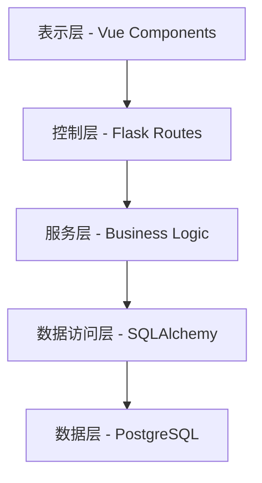
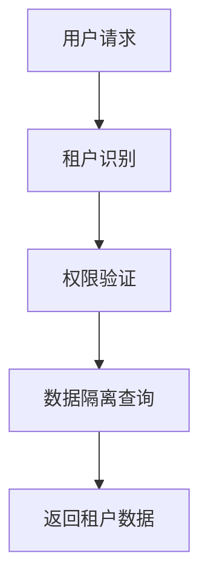
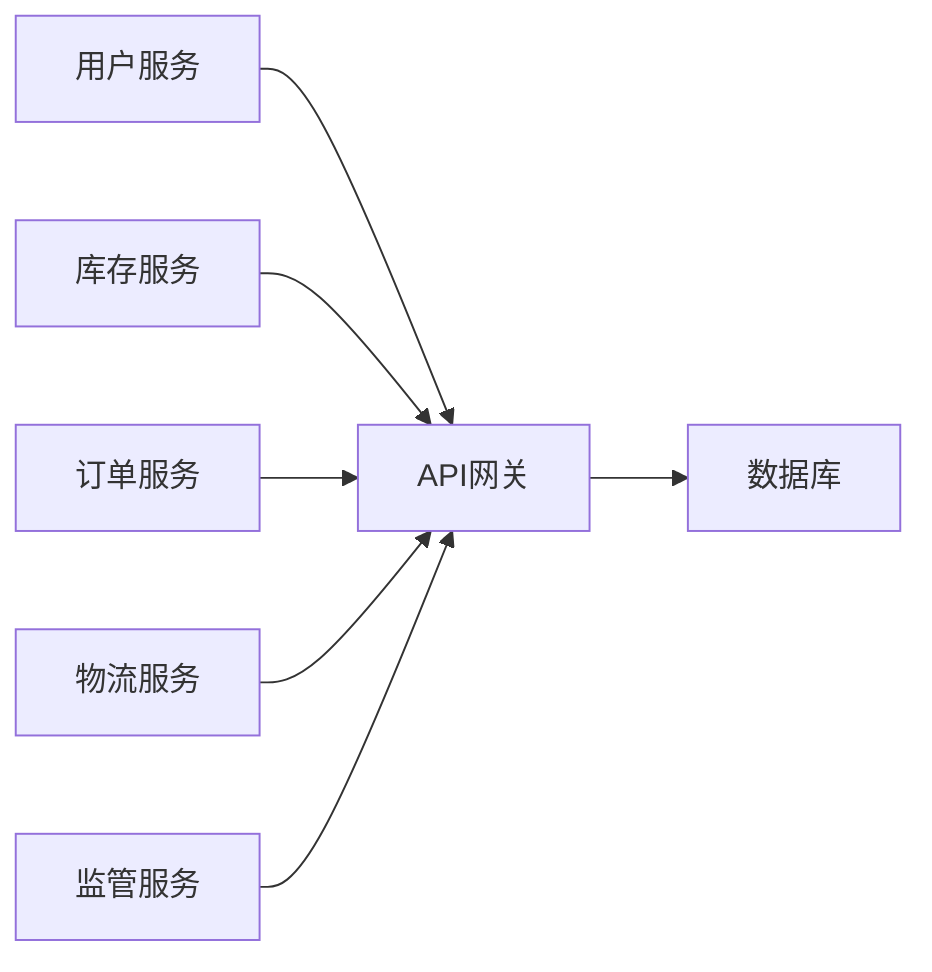
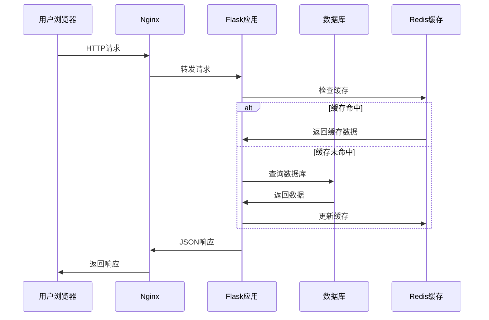
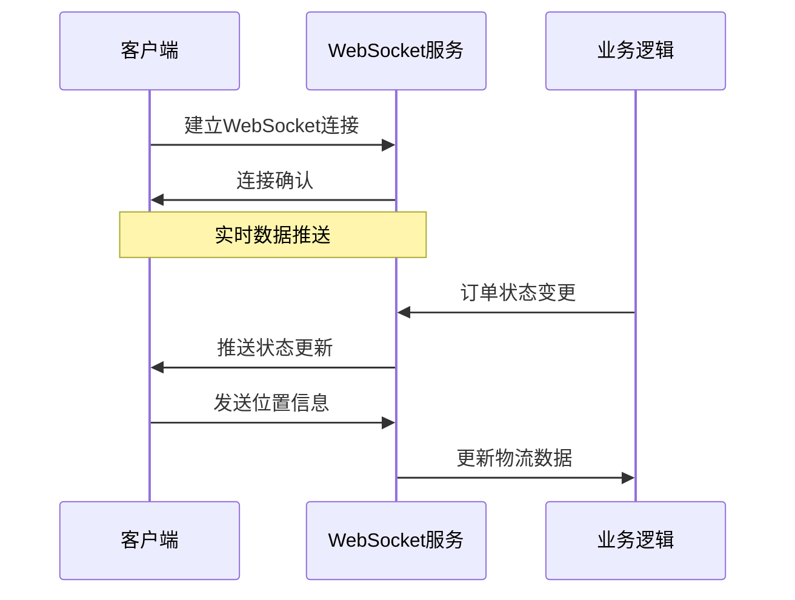
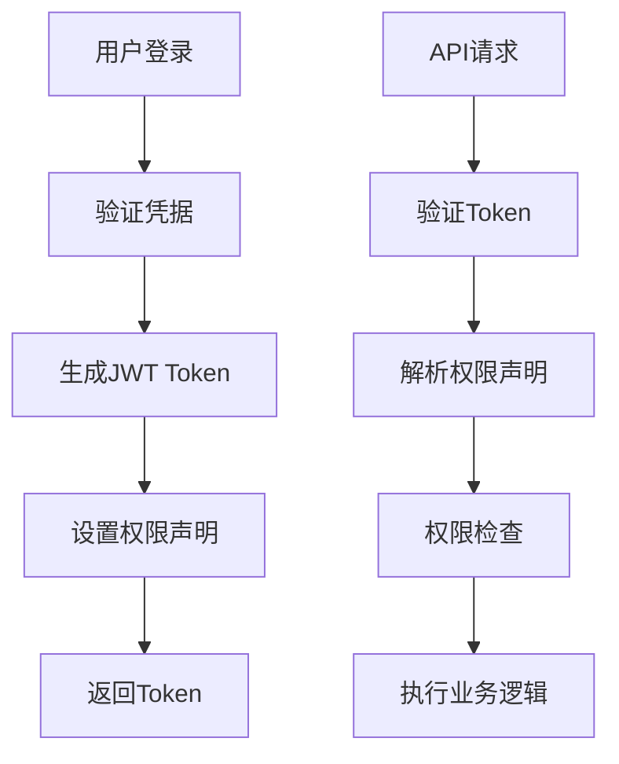

# 系统架构设计

## 🏗️ 整体架构概览

上海药品信息管理与查询平台采用**前后端分离**的B/S架构，结合**微服务设计思想**和**多租户架构**，确保系统的可扩展性、安全性和可维护性。

### 架构分层
```
┌─────────────────────────────────────────────────────────────────┐
│                         前端展示层                                │
│  Vue 3 + Vite + TypeScript + Element Plus + 高德地图API           │
└─────────────────────────────────────────────────────────────────┘
                                │
                                ▼ HTTP/WebSocket
┌─────────────────────────────────────────────────────────────────┐
│                         网关服务层                                │
│              Nginx (反向代理 + 负载均衡 + SSL终端)                │
└─────────────────────────────────────────────────────────────────┘
                                │
                                ▼
┌─────────────────────────────────────────────────────────────────┐
│                         应用服务层                                │
│  Flask + Flask-JWT + Flask-CORS + WebSocket + 业务逻辑服务        │
└─────────────────────────────────────────────────────────────────┘
                                │
                                ▼
┌─────────────────────────────────────────────────────────────────┐
│                         数据访问层                                │
│          SQLAlchemy ORM + 数据库连接池 + 事务管理                 │
└─────────────────────────────────────────────────────────────────┘
                                │
                                ▼
┌─────────────────────────────────────────────────────────────────┐
│                         数据存储层                                │
│      SQLite (开发) / PostgreSQL (生产) + Redis (缓存)             │
└─────────────────────────────────────────────────────────────────┘
```

## 🔧 技术栈详细说明

### 前端技术栈

#### 核心框架
- **Vue 3.4+** - 渐进式JavaScript框架
- **Vite 5.0+** - 现代化前端构建工具
- **TypeScript 5.0+** - 类型安全的JavaScript超集
- **Vue Router 4+** - Vue官方路由管理器
- **Pinia 2+** - Vue状态管理库

#### UI组件库
- **Element Plus** - Vue 3桌面端组件库
- **Tailwind CSS** - 实用优先的CSS框架

#### 地图与可视化
- **高德地图API** - 地图展示、路径规划、地理编码
- **ECharts** - 数据可视化图表库
- **Canvas API** - 自定义图形绘制

#### 开发工具
- **ESLint** - 代码质量检查
- **Prettier** - 代码格式化
- **Vitest** - 单元测试框架

### 后端技术栈

#### 核心框架
- **Flask 2.3+** - Python Web框架
- **Flask-SQLAlchemy** - ORM数据库操作
- **Flask-JWT-Extended** - JWT认证
- **Flask-CORS** - 跨域资源共享
- **Flask-SocketIO** - WebSocket实时通信

#### 数据库
- **SQLite 3** - 开发环境数据库
- **PostgreSQL 14+** - 生产环境数据库
- **Redis 7+** - 缓存和会话存储

#### 认证与安全
- **JWT (JSON Web Token)** - 无状态认证
- **bcrypt** - 密码加密
- **PyCryptodome** - 数据加密

#### API文档
- **Flask-RESTX** - RESTful API文档生成
- **Swagger UI** - API文档界面

### 基础设施

#### Web服务器
- **Nginx 1.20+** - 反向代理、负载均衡、静态文件服务
- **Gunicorn** - Python WSGI服务器

#### 监控与日志
- **Python Logging** - 应用日志
- **Nginx Access Log** - 访问日志
- **自定义监控** - 性能指标收集

## 🏛️ 系统架构模式

### 1. 分层架构模式


**各层职责：**
- **表示层：** 用户界面展示和交互
- **控制层：** HTTP请求处理和响应
- **服务层：** 业务逻辑处理和数据转换
- **数据访问层：** 数据库操作和ORM映射
- **数据层：** 数据持久化存储

### 2. 多租户架构


**数据隔离策略：**
- **行级安全：** 每张表包含tenant_id字段
- **查询过滤：** 自动添加tenant_id条件
- **权限校验：** 前后端双重验证

### 3. 微服务设计思想（单体架构实现）


**服务模块划分：**
- **用户服务：** 认证、授权、用户管理
- **库存服务：** 库存管理、预警通知
- **订单服务：** 交易流程、状态管理
- **物流服务：** 运输跟踪、路径规划
- **监管服务：** 数据分析、报表生成

## 🔄 数据流架构

### 请求处理流程


### WebSocket实时通信


## 🛡️ 安全架构

### 认证授权架构


### 数据安全策略
1. **传输安全：** HTTPS/TLS 1.3加密
2. **存储安全：** 敏感数据加密存储
3. **访问控制：** 基于角色的权限控制
4. **审计日志：** 完整的操作记录
5. **数据备份：** 定期自动备份

## 📊 性能优化策略

### 前端优化
- **代码分割：** 路由级别的懒加载
- **静态资源：** CDN加速和缓存策略
- **组件优化：** Vue 3 Composition API
- **状态管理：** Pinia模块化状态

### 后端优化
- **数据库优化：** 索引优化和查询优化
- **缓存策略：** Redis缓存热点数据
- **连接池：** 数据库连接池管理
- **异步处理：** 后台任务队列

### 系统优化
- **负载均衡：** Nginx负载均衡
- **静态资源：** 分离静态文件服务
- **监控告警：** 实时性能监控
- **自动扩容：** 基于负载的弹性扩容

## 🔧 部署架构

### 开发环境
```
┌─────────────────────────────────────────────────────────┐
│                  开发者机器                              │
│  ┌─────────────┐  ┌─────────────┐  ┌─────────────┐     │
│  │   前端开发   │  │   后端开发   │  │  数据库     │     │
│  │  (npm dev)  │  │ (python)    │  │ (SQLite)    │     │
│  └─────────────┘  └─────────────┘  └─────────────┘     │
└─────────────────────────────────────────────────────────┘
```

### 生产环境
```
┌─────────────────────────────────────────────────────────┐
│                    负载均衡器                             │
│                    (Nginx)                              │
└─────────────────────────────────────────────────────────┘
                                │
                    ┌───────────┼───────────┐
                    ▼           ▼           ▼
┌─────────────┐ ┌─────────────┐ ┌─────────────┐
│   Web服务器  │ │   Web服务器  │ │   Web服务器  │
│  (应用服务)  │ │  (应用服务)  │ │  (应用服务)  │
└─────────────┘ └─────────────┘ └─────────────┘
                    │           │           │
                    └───────────┼───────────┘
                                ▼
┌─────────────────────────────────────────────────────────┐
│                    数据库集群                             │
│              (PostgreSQL主从复制)                        │
└─────────────────────────────────────────────────────────┘
                                │
┌─────────────────────────────────────────────────────────┐
│                    缓存集群                              │
│                    (Redis集群)                           │
└─────────────────────────────────────────────────────────┘
```

## 📈 监控与运维

### 监控指标
- **系统指标：** CPU、内存、磁盘、网络
- **应用指标：** 响应时间、吞吐量、错误率
- **业务指标：** 用户活跃度、订单转化率
- **数据库指标：** 连接数、查询性能、锁等待

### 日志管理
- **应用日志：** 结构化JSON格式
- **访问日志：** Nginx访问记录
- **错误日志：** 异常堆栈信息
- **审计日志：** 用户操作记录

### 备份策略
- **数据库备份：** 每日全量备份 + 实时增量备份
- **文件备份：** 定期备份上传文件
- **配置备份：** 系统配置文件备份
- **异地备份：** 关键数据异地存储

## 🚀 未来架构演进

### 微服务拆分计划
1. **第一阶段：** 用户服务独立部署
2. **第二阶段：** 订单服务独立部署
3. **第三阶段：** 监管服务独立部署
4. **第四阶段：** 完整微服务架构

### 容器化部署
- **Docker容器化：** 应用服务容器化
- **Kubernetes编排：** 容器编排和管理
- **服务网格：** Istio服务治理
- **DevOps流水线：** CI/CD自动化

### 云原生改造
- **多云部署：** 支持多云环境
- **弹性伸缩：** 自动弹性扩缩容
- **服务治理：** 完整的服务治理体系
- **可观测性：** 全链路监控和追踪

---

**文档版本：** v1.0
**创建时间：** 2024-10-25
**更新时间：** 2024-10-25
**维护人员：** 架构团队