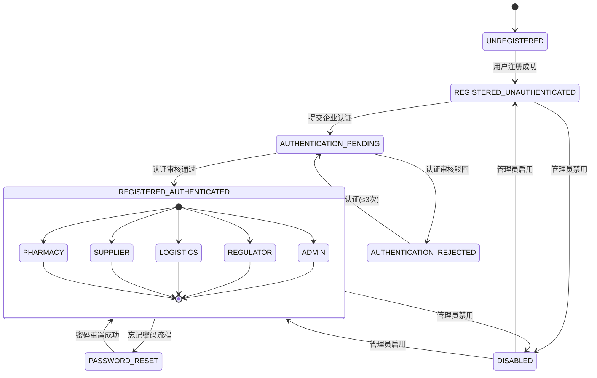
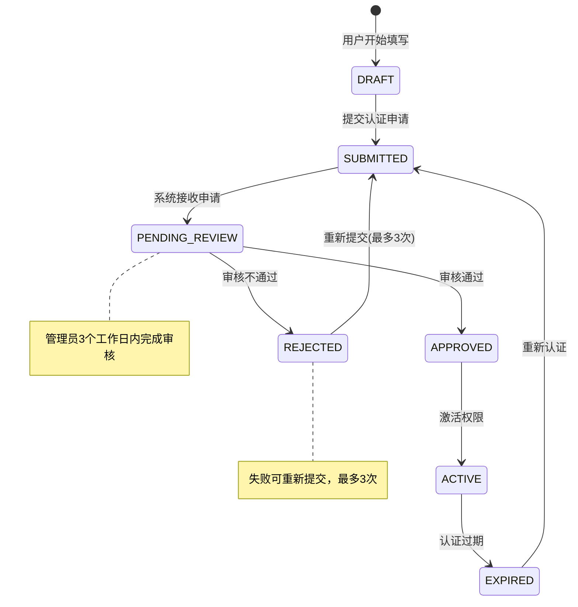
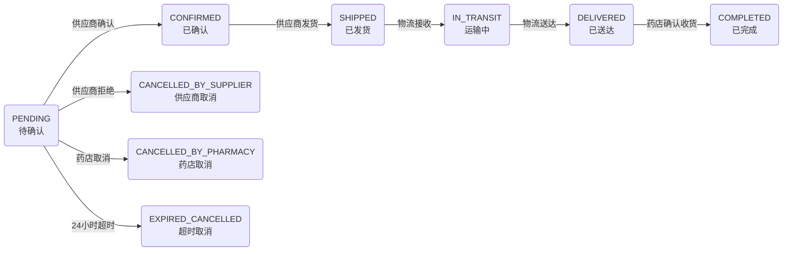
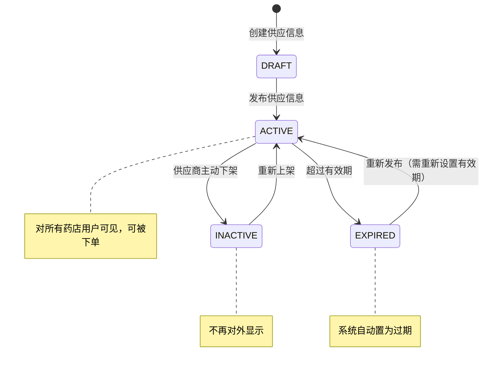
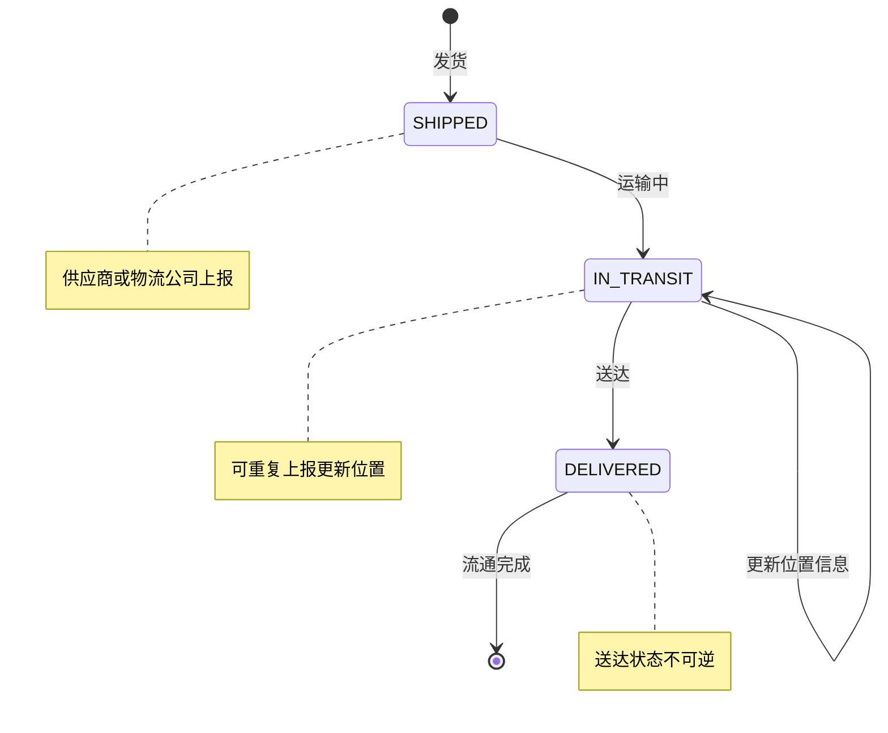
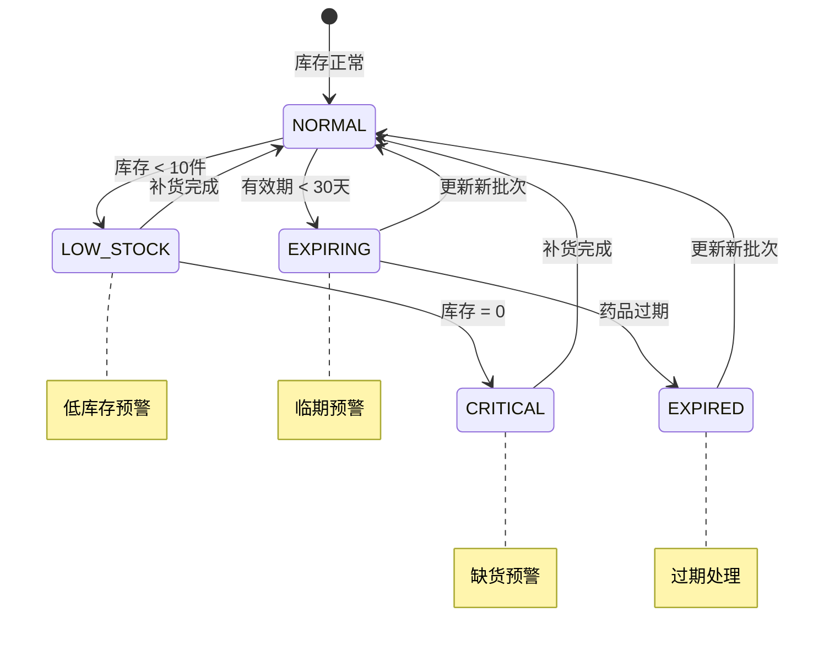

# 上海药品信息管理平台 - 核心业务流程状态机图

## 1. 用户账户状态机



**状态说明：**
- **UNAUTHENTICATED**: 未认证用户
- **PHARMACY**: 药店用户
- **SUPPLIER**: 供应商用户
- **LOGISTICS**: 物流用户
- **REGULATOR**: 监管用户
- **DISABLED**: 已禁用

## 2. 企业认证流程状态机



**状态说明：**
- **DRAFT**: 用户保存申请草稿
- **SUBMITTED**: 已提交申请
- **PENDING_REVIEW**: 审核中
- **APPROVED**: 审核通过
- **REJECTED**: 审核不通过
- **ACTIVE**: 权限激活
- **EXPIRED**: 认证过期

## 3. 订单管理流程状态机



**状态说明：**
- **PENDING**: (待确认) - 药店已下单，等待供应商确认
- **CONFIRMED**: (已确认) - 供应商确认接受订单
- **SHIPPED**: (已发货) - 供应商已发货，等待物流接收
- **IN_TRANSIT**: (运输中) - 物流已接收，正在运输途中
- **DELIVERED**: (已送达) - 药品已送达目的地
- **COMPLETED**: (已完成) - 药店已确认收到药品，订单完成
- **CANCELLED_BY_PHARMACY**: (药店取消) - 药店在待确认期间取消
- **CANCELLED_BY_SUPPLIER**: (供应商取消) - 供应商拒绝接受订单
- **EXPIRED_CANCELLED**: (超时取消) - 供应商24小时内未响应


## 4. 供应信息状态机



**状态说明：**
- **DRAFT**: 供应信息的草稿
- **ACTIVE**: 活跃/上架（可被查看和下单）
- **INACTIVE**: 非活跃/下架（用户主动下架）
- **EXPIRED**: 已过期（超过有效期）

## 5. 流通记录状态机



**状态说明：**
- **SHIPPED**: 已发货
- **IN_TRANSIT**: 在途运输
- **DELIVERED**: 已送达


## 6. 库存预警状态机



**状态说明：**
- **NORMAL**: 正常状态
- **LOW_STOCK**: 低库存预警
- **CRITICAL**: 缺货预警
- **EXPIRING**: 临期预警
- **EXPIRED**: 已过期

## 技术实现要点

### 数据库字段设计
```sql
-- 企业认证表
enterprise_certifications (status ENUM('SUBMITTED','PENDING_REVIEW','APPROVED','REJECTED','ACTIVE','EXPIRED'))

-- 订单表（9种完整状态）
orders (status ENUM('PENDING','CONFIRMED','SHIPPED','IN_TRANSIT','DELIVERED','COMPLETED','CANCELLED_BY_PHARMACY','CANCELLED_BY_SUPPLIER','EXPIRED_CANCELLED'))

-- 供应信息表
supply_info (status ENUM('ACTIVE','INACTIVE','EXPIRED'))

-- 流通记录表（与订单状态同步）
circulation_records (status ENUM('SHIPPED','IN_TRANSIT','DELIVERED'))

-- 用户表
users (status ENUM('ACTIVE','DISABLED'), role ENUM('UNAUTHENTICATED','PHARMACY','SUPPLIER','LOGISTICS','REGULATOR','ADMIN'))
```

### 状态转换验证
- 前端：根据当前状态控制按钮显示和操作权限
- 后端：API接口验证状态转换的合法性
- 数据库：使用ENUM约束确保状态值有效

### 操作日志记录
- 所有状态变更记录到 `operation_logs` 表
- 包含：操作人、时间、操作类型、状态变化详情
- 支持审计追踪和问题排查
